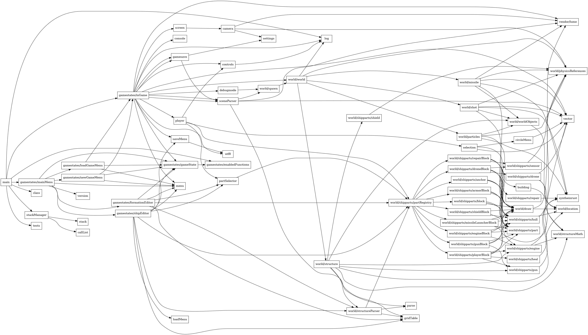

A tool for generating dependency graphs for Lua code.

	Usage: dependency-graph.lua [--text | --dot] [--dir ROOT_DIR] [ROOT_FILE]
	If ROOT_FILE is unspecified, main.lua will be used.

See [Synthein][1] for an example of how to use it.

Sample output:

Public domain.

[1]: https://github.com/synthein/synthein/blob/4b775afd9e799576fbe5ad206e488123cfc1c99c/Makefile#L38
